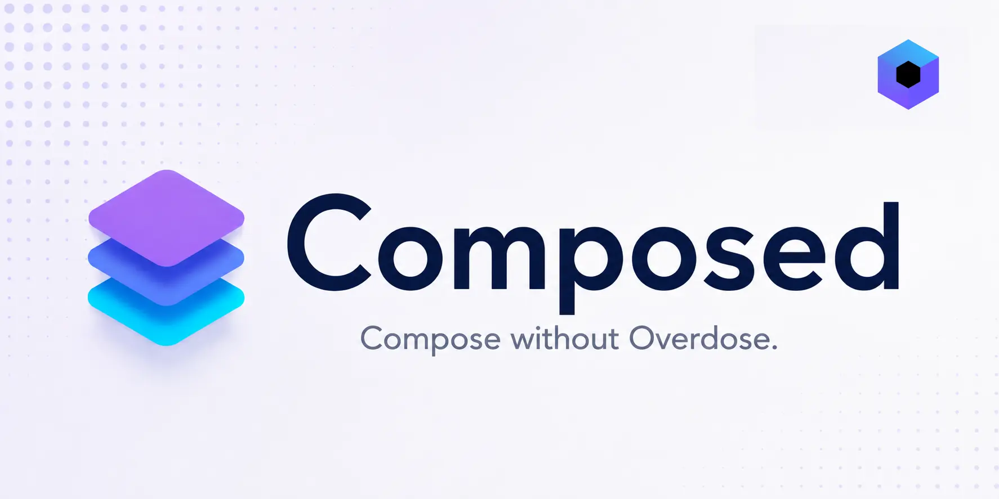

<p align="center">
    
</p>

<p align="center">
    
    

<a href="https://android-arsenal.com/api?level=21">
    
</a>

<a href="https://central.sonatype.com/artifact/io.github.w2sv/composed-core">
    
</a>

<a href="https://w2sv.github.io/Composed/">
    
</a>

<a href="https://github.com/w2sv/Composed/actions/workflows/build.yaml">
    
</a>


</p>

<p align="center">
    
    
    
    
</p>

---

<p align="center">
    <b>Small Compose helpers you keep pasting from project to project.</b>
</p>

Composed is a lightweight utility library
for [Compose Multiplatform](https://github.com/jetbrains/compose-multiplatform) that fills in
recurring gaps around Compose APIs.
It provides focused helpers for **effects, snapshot state and savers, modifier composition, layout,
gesture coordination, focus handling, animations, and Material 3 behavior** — without introducing a
framework, design system, or collection of opinionated UI components.

Platform-specific utilities stay explicitly scoped to their respective targets, while the common API
remains usable across supported Compose Multiplatform platforms.

See the [API reference](https://w2sv.github.io/Composed/) for the full documentation.

> Web/Wasm support follows Compose Multiplatform's Beta status.

## ✨ API highlights

### Modifier composition

Conditionally build modifier chains without repeatedly starting from `Modifier`:

```kotlin
Modifier
    .padding(16.dp)
    .then {
        when {
            isSelected -> background(Color.Green)
            isDisabled -> alpha(0.5f)
            else -> this
        }
    }
    .thenIf(isFocused) {
        border(1.dp, Color.Blue)
    }
    .thenIfNotNull(backgroundColor) {
        background(it)
    }
```

### Shake animation

Apply a configurable horizontal shake animation:

```kotlin
val shakeController = rememberShakeController(
    amplitude = 20.dp,
    durationMillis = 400,
    frequencyHz = 8f,
    decay = 0.5f
)

Box(modifier = Modifier.shakenBy(shakeController))

scope.launch {
    shakeController.shake()
}
```

### Lazy grid item entrances

Stagger lazy grid items from the edge associated with the current scroll direction:

```kotlin
val gridState = rememberLazyGridState()
val entranceState = rememberLazyGridItemEntranceState(gridState)

LazyVerticalGrid(
    columns = GridCells.Fixed(3),
    state = gridState
) {
    items(
        items = products,
        key = { it.id }
    ) { product ->
        ProductCard(
            product = product,
            modifier = Modifier.animateLazyGridItemEntrance(
                itemKey = product.id,
                state = entranceState,
                delay = LazyGridItemEntranceDelay.diagonal(
                    mainAxisInterval = 200.milliseconds,
                    crossAxisInterval = 100.milliseconds
                )
            )
        )
    }
}
```

The API also supports horizontal grids. You can implement your own LazyGridItemEntranceDelay strategies,
configure whether an item animation should be shown on every composition or only once per key, and more.

### Animated spacing rows and columns

Using `AnimatedVisibility` inside a stock `Column(verticalArrangement = Arrangement.spacedBy(...))` leaves the
arrangement spacing outside the visibility animation. The child collapses, but the full gap remains until composition
changes, which can produce an empty gap or a visible jump. `AnimatedSpacingColumn` animates that spacing together with
the child's occupied height and keeps the gaps on both sides symmetric. `AnimatedSpacingRow` provides the equivalent
behavior for a horizontal layout.

```kotlin
// The 12.dp gaps do not participate in AnimatedVisibility's transition.
Column(verticalArrangement = Arrangement.spacedBy(12.dp)) {
    AnimatedVisibility(visible = firstVisible) { FirstFilter() }
    AnimatedVisibility(visible = secondVisible) { SecondFilter() }
}
```

Use the animated-spacing scope instead:

```kotlin
@OptIn(ExperimentalAnimatedSpacingApi::class)
@Composable
fun FilterList(filters: List<Filter>, selectedFilters: Set<Filter>) {
    AnimatedSpacingColumn(
        spacing = 12.dp,
        horizontalAlignment = Alignment.Start
    ) {
        filters.forEach { filter ->
            AnimatedVisibility(
                visible = filter in selectedFilters,
                animationSpec = spring(),
                label = "${filter.id}:visibility"
            ) {
                FilterChip(
                    selected = true,
                    onClick = { /* ... */ },
                    label = { Text(filter.label) }
                )
            }
        }
    }
}
```

Both layouts retain the respective stock scope's weight and alignment modifiers, including alignment lines and row
baselines. Animated weighted children progressively release and redistribute their allocation as they disappear.
Animation is measurement-driven—without lookahead or per-frame recomposition—and ordinary, non-animated weights stay
on an O(n) path.

These are eager experimental layouts, not lazy containers or drop-in replacements for every `Row`/`Column` arrangement.
They support fixed spacing, add a clipping graphics layer around animated children, and weighted redistribution involving
visibility-controlled weighted children is O(n²). See the API reference for the complete behavior and limitations.

### Snackbar launching

Show snackbars from event handlers without manually carrying around a `SnackbarHostState`, `CoroutineScope`, and, on Android, a `Context`:

```kotlin
val snackbarLauncher = rememberSnackbarLauncher(snackbarHostState)

Button(
    onClick = {
        snackbarLauncher.show { MySnackbarVisuals(message = getString(R.string.saved)) }
    }
) {
    Text("Save")
}
```

Compared to the usual pattern:

```kotlin
val scope = rememberCoroutineScope()
val context = LocalContext.current

Button(
    onClick = {
        scope.launch {
            snackbarHostState.showSnackbar(
                MySnackbarVisuals(
                    message = context.getString(R.string.saved)
                )
            )
        }
    }
) {
    Text("Save")
}
```

`SnackbarLauncher` keeps coroutine launching and snackbar presentation behind one non-suspending API while still exposing the current snackbar state and explicit replacement or dismissal operations.
For suspending snackbar display, you may use the `SnackbarController`.

### Focus clearing

Coordinate focus clearing from anywhere in the composition without passing around a `FocusManager`:

```kotlin
val focusClearingController = rememberFocusClearingController()

focusClearingController.Bind()

Column(modifier = Modifier.clearFocusOnTap(focusClearingController)) {
    // ...
}

Button(onClick = focusClearingController::requestClearFocus) {
    Text("Clear focus")
}
```

`FocusClearingController` can also automatically clear focus when the IME transitions from visible
to hidden.

## 📦 Modules

| Module               | Description                                                                      |
|----------------------|----------------------------------------------------------------------------------|
| `composed-core`      | General-purpose Compose utilities. Contains also Android-only utilities.         |
| `composed-animation` | Reusable animation controllers, animated spacing layouts, and lazy-grid entrances. |
| `composed-material3` | Utilities and extensions for Compose Material 3 layouts, drawers, and snackbars. |

Android permission-state utilities are available separately
at [AugmentedPermissions](https://github.com/w2sv/AugmentedPermissions).

## 🚀 Installation

### Inline

```kotlin
dependencies {
    implementation("io.github.w2sv:composed-animation:<version>")
    implementation("io.github.w2sv:composed-core:<version>")
    implementation("io.github.w2sv:composed-material3:<version>")
}
```

### Version Catalog (`libs.versions.toml`)

```toml
[versions]
w2sv-composed = "<version>"

[libraries]
w2sv-composed-animation = { module = "io.github.w2sv:composed-animation", version.ref = "w2sv-composed" }
w2sv-composed-core = { module = "io.github.w2sv:composed-core", version.ref = "w2sv-composed" }
w2sv-composed-material3 = { module = "io.github.w2sv:composed-material3", version.ref = "w2sv-composed" }
```

**build.gradle.kts:**

```kotlin
dependencies {
    implementation(libs.w2sv.composed.animation)
    implementation(libs.w2sv.composed.core)
    implementation(libs.w2sv.composed.material3)
}
```

## 🖥️ Desktop playground

The [`playground`](playground) module contains a Compose Desktop app for interactively
testing visual and behavioral APIs.

Run it with:

```bash
./gradlew :playground:run
```

Without arguments, the playground opens a sample picker. To launch a sample directly:

```bash
./gradlew :playground:run --args=lazy-grid-item-entrance
```

Or launch it with Compose Hot Reload:

```bash
./gradlew :playground:hotRunJvm --auto
```

Direct sample selection uses the same argument with hot reload:

```bash
./gradlew :playground:hotRunJvm --auto --args=lazy-grid-item-entrance
```

Show launch options and available sample IDs with:

```bash
./gradlew :playground:usage
```

## 📄 License

Designed and developed by w2sv (Janek Zangenberg).

Licensed under the [Apache License 2.0](LICENSE).
